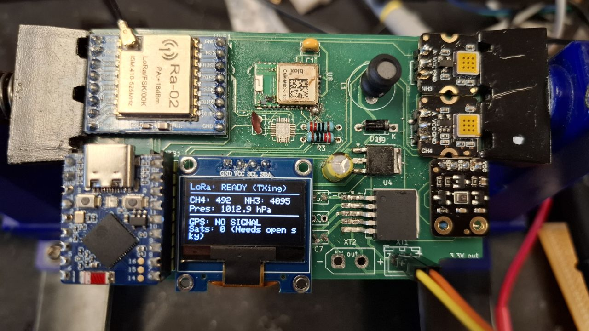
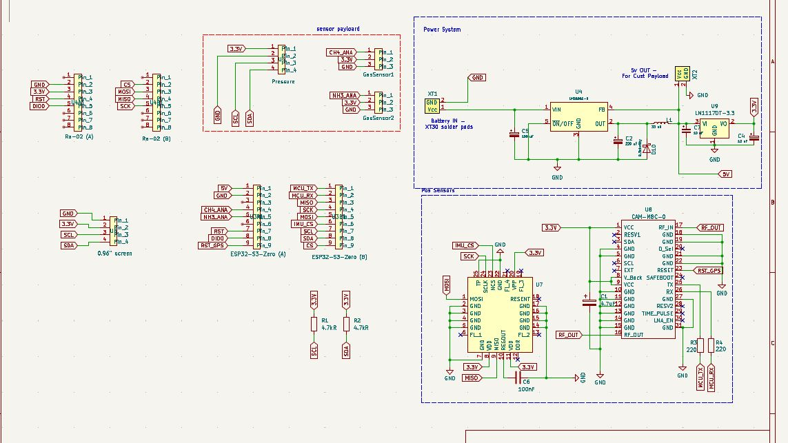
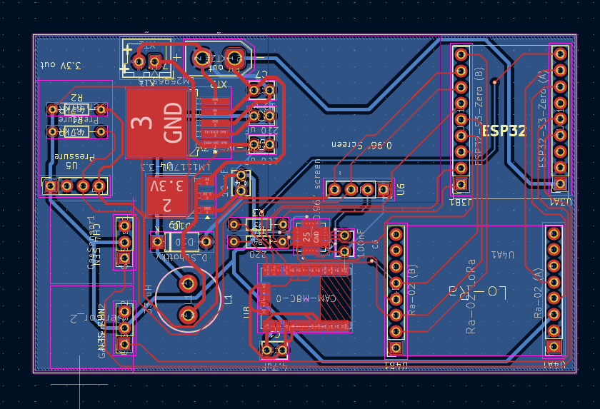

# PERRII – Aerospace Flight Computer version 2

## Project Overview
PERRII is a modular aerospace flight computer designed for environmental sensing and long-range data telemetry. The system is built around the ESP32-S3 Zero microcontroller and is designed to function as a scientific payload for high-altitude ballooning or atmospheric research. It integrates precision GNSS positioning, environmental gas sensing (Methane and Ammonia), and a robust power regulation system.

## My Contribution: LoRa Communication Subsystem
As the lead for the communication system, I was responsible for the hardware integration and signal integrity of the long-range telemetry link.

### Key Technical Implementations:
* **RFM98W Integration**: Integrated the RFM98W-433S2 LoRa transceiver to provide a robust, low-power, long-distance communication link between the flight computer and the ground station.
* **RF Hardware Design**: Designed the antenna interface for the AE1 Antenna, including a 100pF decoupling capacitor (C5) to ensure signal stability.
* **SPI Interface Management**: Configured the SPI bus (MOSI, MISO, SCK, NSS) to interface the RF module with the ESP32-S3, managing critical interrupt lines (DIO0-DIO5) for real-time packet handling.
* **RF Layout Optimization**: Optimized the trace routing between the RF transceiver and the antenna connector to maintain signal integrity in a compact, circular PCB form factor.

## System Architecture
While my primary focus was the communication link, I worked closely with the team to integrate the following subsystems:

### 1. Navigation & Sensing
* **GNSS Positioning**: Integration of a u-blox CAM-M8C-D GPS module for real-time tracking.
* **Environmental Monitoring**: Active monitoring of atmospheric data via SEN1 (Methane) and SEN2 (Ammonia) gas sensors.
* **Visual Telemetry**: A dedicated LED altitude output array driven by the AW9523B LED driver.

### 2. Power Management
* **Dual-Stage Regulation**: The system utilizes a high-efficiency LM2596S-5 switching buck converter for the primary 5V rail and an LM1117DT-3.3 LDO for the sensitive logic and RF rails.
* **Robust Input**: Featuring XT-30 battery connectors and reverse polarity protection via a D10 Schottky diode.

## Design Files
### 1. Schematic Design
The schematic follows a modular design separated into Power, TX, Sensor, and GPS blocks.

### 2. PCB Layout
A circular 2-layer board designed for cylindrical aerospace housing.

## Team & Credits
* **Lok Yu Lui (Rain)**: Hardware Engineer – LoRa Communication Subsystem, Power Systems, and Sensor Payloads.
* **PERRII Team**: Collaborative effort for MCU integration and software.
